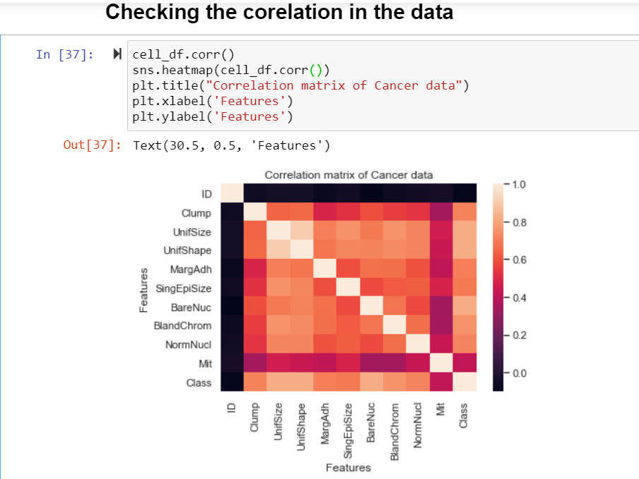
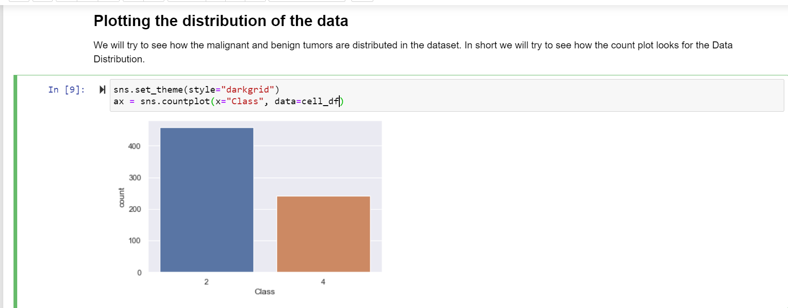

# Project Name :-
Cancer Detetction Project: 

### Project Intro/Objective :-
Cancer can start almost anywhere in the human body, which is made up of trillions of cells. Normally, human cells grow and divide to form new cells as the body needs them. When cells grow old or become damaged, they die, and new cells take their place.

When cancer develops, however, this orderly process breaks down. As cells become more and more abnormal, old or damaged cells survive when they should die, and new cells form when they are not needed. These extra cells can divide without stopping and may form growths called tumors.

According to Survey, there are 18 million cancer cases around the globe annually and around 8.8 million death per year.
In this project, we will build and train a model using human cell records, and classify cells to whether the samples are benign or malignant. The End goal is to classify whether the Human cells are benign in nature or they are malignant in nature, to detect this in the early stage can save the lives of thousands of people.

### Algorithms Used :-
1. Random forest
2. Hypertuning methods
    - Randomized Search CV
    - Grid Serach CV

### Language Used :-
- Python 3.8
### Python Libarary used :-
- scikit-learn
- pandas
- matplotlib
- seaborn
- numpy

### Data Set :- 

 The example is based on a dataset that is publicly available from the UCI Machine Learning Repository (Asuncion and Newman, 2007).[http://mlearn.ics.uci.edu/MLRepository.html]. The dataset consists of several hundred human cell sample records, each of which contains the values of a set of cell characteristics. The fields in each record are: 

### Field Names :-
----------------------------------------
1. ID	Clump       
2. Clump	        
3. UnifSize	    
4. UnifShape	    
5. MargAdh	    
6. SingEpiSize	
7. BareNuc	    
8. BlandChrom	    
9. NormNucl	    
10. Mit	        
11. Class	        

## Getting Started :-

1. Raw Data is being kept under the project repo with the name drug200.csv    
2. Data processing/transformation scripts are coded under cancer_prediction.ipynb
3. OOPS code is present in cancerprediction.py

### Feature Engineering:
   
## Exploratory Data Analysis :-
- ### Correlation Matrix: 
    Here we are trying to see how our data are correlated to each other if there exists high or low correlation between the independent variables.
      

- ### Class Distribution : 
     Here we are trying to see how the benign vs malignant tumors are distributed, we try to see if there is a case of the imbalanced dataset.
     The ratio of Benign : Malignant cell is 2:1 , hence we dont land in the area of imbalanced data sets here.

## Shape of Train and Test Data :-
   We performe the train test split of data set means a larger portion of data we keep as training dataset while a smaller portion of test dataset.
   - Train data set : 80%
   - Test data set : 20% 
   
   The reason we do train test split is because:
   - To see if we are overfitting the model
   - To see if we are undefitting the model
   - To see if our model performs in a well behaved fashion on both train and test data.

- Train Data (546, 9) (546,)
- Test Data (137, 9) (137,)

## Hyperparameter Tuning :-
   In an Ideal scenario, a model should not be trained on the default parameter, meaning the parameters of the ML algorithm has to be trained,
   The reason for hyperparameter tuning is to obtain the best parameters and use that on the ML Algorithm to obtain the best results.
   We have various hyperparameter tuning techniques, but in this project, I have used two widely used tuning techniques.
   - Randomized Search CV
   - Grid Search CV
   
   The Random Forest algorithm first trains itself using Randomized search CV, as the name suggests it randomly tries to search in the given search space
   and then spits the best params out of those random searched space.
   Then we apply the Grid Search CV on the trained params of the Randomized search by taking that as the baseline, Grid search looks into each grid one by one and then
   gives the best parameter for the Random Forest algorithm.

## Featured Notebooks/Analysis/Deliverables :-
- cancer_prediction.ipynb
- cancerprediction.py

## Metrics Used to determine results :-
1.) Recall Score
   - tp / (tp + fn)

| Classifier | Recall Score  |
|------------|---------------|
|Benign(2)   | 0.96          |
|Malignant(4)| 1.00          |
